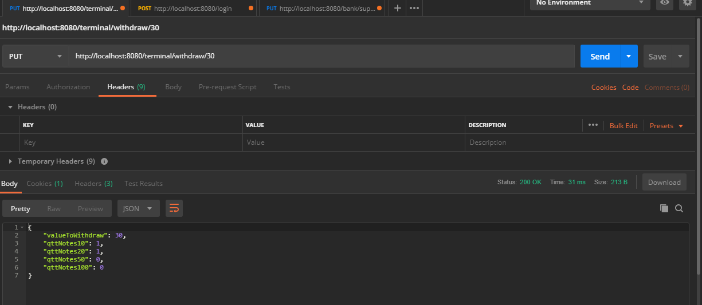
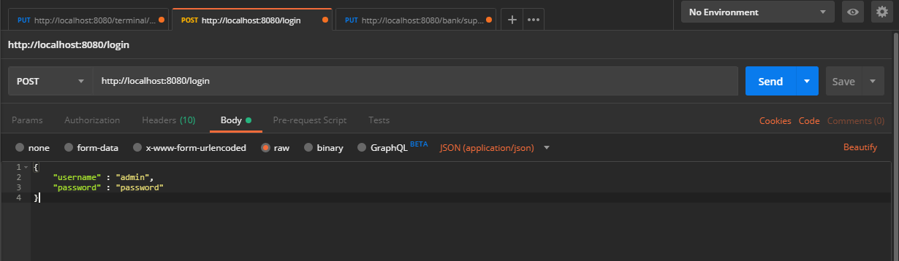
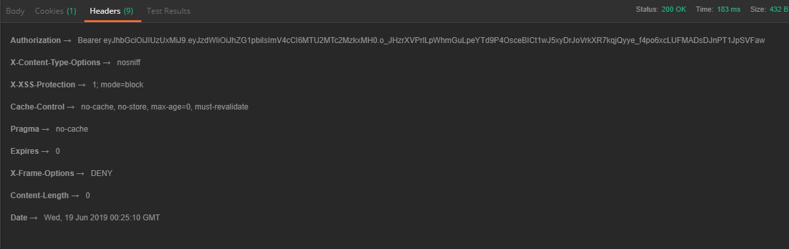
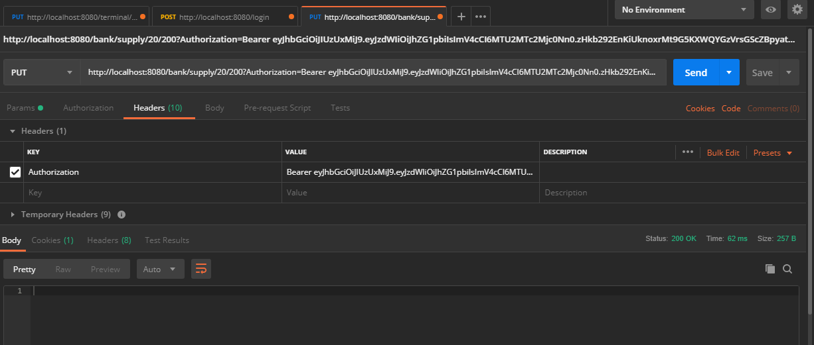

# EletronicSystem - Caixa Eletrônico

-- Projeto Desenvolvido com Java 8 

<b>Projeto com duas api's:</b> 

  módulo - <b>eletronic-withdrawal-system</b> 
  É o saque bancário, no qual você manda um Http PUT no seguinte endpoint para saque:
    - http://localhost:8080/terminal/withdraw/30       <- aonde o valor final é a quantia de saque desejada
 
 módulo - <b>bank-api</b> 
 É o sistema de abastecimento do banco, conforme zera a quantia de notas no banco de dados, aonde os endpoints somente são requisitadas com um JWT válido ( no projeto eletronic-system voce o encontra em application.properties)
  -Caso você queria gerar um novo token, você envia um POST pro endpoint http://localhost:8090/login mandando no body um json com username e password (username: username, password:password), no header virá o token, você simplemente insere no application.properties na key <b>api_published_key=token</b>
 

Para que os projetos rodem corretamente, é preciso que cada um rode em uma porta diferente, que já está configurado o eletronic-withdrawal-system para a porta 8080 e o bank-api para a porta 8090

<b>Primeiro passo:</b> Abra os dois projetos separados como Maven Project dentro do Eclipse. 
<b>Segundo passo:</b> Clique com o botão direito na classe dos dois projetos, Run as ... -> Java Application (Faça isso para os dois projetos) 

<b>Terceiro passo:</b>
O banco de dados da aplicação que foi MySQL, você deve executar em seu banco de dados local,segue as querys para o Start do projeto: 
<code>
CREATE DATABASE ELETRONIC_SYSTEM;
</code> 
Após subir a primeira vez, o hibernate irá automaticamente criar as tabelas, depois desse procedimento, insira os seguintes dados: 

      insert into terminal values(1,"Terminal Rua Augusta", 1);
      insert into drawer_terminal values(1,1,10,0);
      insert into drawer_terminal values(2,1,20,0);
      insert into drawer_terminal values(3,1,50,0);
      insert into drawer_terminal values(4,1,100,0);

# Testando a api no POSTMAN

Exemplo do postman, aonde o valor "30" é a quantia do saque, a api retorna a quantidade de notas de cada cédula.

Para você gerar seu token de autenticação, mande POST para a seguinte endpoint conforme a imagem:

Seu token, caso autenticado, estará na aba Headers em Authorization, guarde ele, pois será seu token de uso do bank-api

Para testar a bank API, no campo key você escreve "Authorization" e no value você insere o token fornecido pra você no login.
Nesse endpoint , você passará o tipo de nota que voce quer abastecer e a quantia de notas -> http:localhost:8090/bank/supply/TIPODENOTA/QUANTIDADEDENOTAS, vale lembrar que estão disponiveis somente notas de 100,50,20 e 10

Irá te retornar OK caso tenha sido abastecido o caixa eletrônico.
